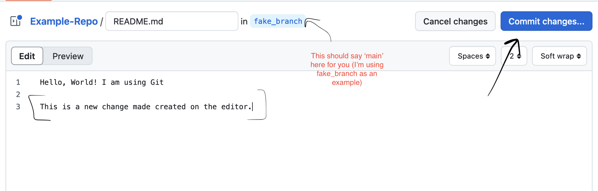

# ModEM Git Primer

Here is a short primer on using Git.

# Cloning a Repo (SVN Checkout)

As an example, we will be using this repo: [https://github.com/MiCurry/Example-Repo].

Navigate to that repository and grab the git repository link:


Note that this is different than the web address and end in the extension of
.git, in this case grab the HTTPS link:
https://github.com/MiCurry/Example-Repo.git

> *Note*: The git@github.com:MiCurry/Example-Repo.git is for use if you have
> set up SSH keys on GitHub.


Assuming git is installed on your machine, open up a terminal and clone the
repository:

```
$ git clone https://github.com/MiCurry/Example-Repo.git
Cloning into 'Example-Repo'...
remote: Enumerating objects: 6, done.
remote: Counting objects: 100% (6/6), done.
remote: Compressing objects: 100% (2/2), done.
remote: Total 6 (delta 0), reused 6 (delta 0), pack-reused 0 (from 0)
Receiving objects: 100% (6/6), done.
```

Then, `cd` into the repo: `cd Example-Repo`.

**Git Branch**

Now that we are in the repo, we can type `git branch` to see which branch we are
on and which branches we have checkouted locally. After a clone, this will
always be the default branch of a repository, normally this branch is either
called master or main:

```
$ git branch
* main
```

We can see that we are in fact on branch main.

**Git Remote**

We can use `git remote` to tell us which remotes we have associated with 
our local working clone:

```
$ git remote -v
origin	git@github.com:MiCurry/Example-Repo.git (fetch)
origin	git@github.com:MiCurry/Example-Repo.git (push)
```

So far, that is just `origin`, which is the default name for the repository
you clone from.

Later, we will use `git remote` to add forks of origin to aid in development.

**Git Log**

Let's use Git log to see the log of the repository.

```
$ git log
commit 16e76274960323d1bf72bd9e346502beff44744a (HEAD -> main, origin/main, origin/HEAD)
Author: Miles Curry <2590700+MiCurry@users.noreply.github.com>
Date:   Wed Feb 19 15:40:30 2025 -0700

    Add Hello, World to README.md
    
    This commit adds 'Hello, World' to the README. The above first line is the
    short commit message and will appear in various places. It should be less than
    80-90 characters and should just be a short, recognizable summary of the
    changes made. We can always add more information in this section.

commit 3cd7cc7bc325db339900e3b6589744ff146c1e2a
Author: Miles Curry <2590700+MiCurry@users.noreply.github.com>
Date:   Wed Feb 19 15:22:10 2025 -0700

    Initial commit - Track empty README.md
```

Here, we can see the two commits that are apart of the main branch. Git doesn't
use revision numbers like SVN, instead it uses git hashes. These are the long
strings of numbers and letters after the word commit. 

Something I find handy, is on the first line we see the following next to the
top commit:

```
(HEAD -> main, origin/main, origin/HEAD)
```

The important bit here is the `origin/main`. This tag next to the commit tells
us that the 16e762 commit is most recent for the branch main for the remote
repository origin (written as origin/main). We will come back to this later.

Also important, is the `HEAD -> main` bit essentially tells us that we are
currently editing the main branch. 

> **NOTE:** `HEAD` here can be thought of as the head of a pen. Wherever our
> `HEAD` is pointing locally, will be where new commits appear. Thankfully,
> this is always the branch we checked out. It's not super important, but it help
> explain things a bit.


# Branching, adding files and creating commits

Now, let's create a branch, add a new file and then commit it. If we pass `git
branch <name>`, it will automatically create a new branch that is *identical* to
the one we are current one:

```
$ git branch my_branch
```

We can then use `git branch` to see that this branch was created:

```
$ git branch
* main
  my_branch
```

But if you notice, we are still on the main branch, so we will need to checkout
the new branch using `git checkout`:

```
$ git checkout my_branch
Switched to branch 'my_branch'
$ git branch
  main
* my_branch
```

> **TIP:** One can use `git checkout -b <branch-name>` to automatically create a new 
> branch and check it out at the same time.

Now, run git log:

```
$ git log
commit 16e76274960323d1bf72bd9e346502beff44744a (HEAD -> my_branch, origin/main, origin/HEAD, main)
... ommitting the details
```

We can now see that our 'HEAD' is now pointing at the 'my_branch'. We can also
see that last commit of our `new_branch` is the same as the origin/main. This
essentially tells us that our branch is currently equal to that of main.

Let's now make some changes to our repository. First, lets add a new file and
add some text to it:

```
$ touch my_file
$ echo "Hello, World. This is the new file" > my_file
```

Now, let's add some more text to the README.md:

```
$ echo "I am adding more text to the readme" >> README.md
$ git status
On branch my_branch
Changes not staged for commit:
  (use "git add <file>..." to update what will be committed)
  (use "git restore <file>..." to discard changes in working directory)
	modified:   README.md

Untracked files:
  (use "git add <file>..." to include in what will be committed)
	my_file

no changes added to commit (use "git add" and/or "git commit -a")
```

After making our change, and running `git status` git gives shows us the status
of current repository. This summary is very similar to that of SVN's status.
It includes: list of tracked files that have been changed (README.md in this
example) and a list of untracked files (my_file).

We can run `git diff` to see what's been currently been altered (note that this
will not include untracked files!):

```
$ git diff
diff --git a/README.md b/README.md
index ba96995..70720e0 100644
--- a/README.md
+++ b/README.md
@@ -1 +1,2 @@
 Hello, World! I am using Git
+I am adding more text to the readme
```

Running `git diff` with no arguments will show us all differences (in this
case, it's just in one file), but we can also run `git diff <filename>` to see
the changes made to a specific file.

**Adding new files to tracking, staging files and committing them**

Let's re-run git status to pull up the list of files that have been changed or
that are untracked:

```
$ git status
On branch my_branch
Changes not staged for commit:
  (use "git add <file>..." to update what will be committed)
  (use "git restore <file>..." to discard changes in working directory)
	modified:   README.md

Untracked files:
  (use "git add <file>..." to include in what will be committed)
	my_file

no changes added to commit (use "git add" and/or "git commit -a")
```

Let's first add the untrack file so that git will start tracking changes on it.
We can do this operation using `git add` which is similar to `svn add`:

```
$ git add my_file   # Produces no output
$ git status
On branch my_branch
Changes to be committed:
  (use "git restore --staged <file>..." to unstage)
	new file:   my_file

Changes not staged for commit:
  (use "git add <file>..." to update what will be committed)
  (use "git restore <file>..." to discard changes in working directory)
	modified:   README.md
```

We can now see that `my_file` is now under the 'Changes to be committed'
section.

Now let's commit the changes we made to README.md. Unlike SVN, we need to
specify what tracked files that we want to be committed, this is called staging.
We do this operation again by using `git add`, but do it on files that are
already tracked and have changes:

```
$ git add README.md
$ git status
On branch my_branch
Changes to be committed:
  (use "git restore --staged <file>..." to unstage)
	modified:   README.md
	new file:   my_file
```

Now, `README.md` and `my_file` are ready to be committed. If you make a mistake
here you can follow git's instructions and use `git restore --staged <file>` to
unstage a specific file, likewise, you can also type `git reset` to unstage all
files (your changes will not disappear).

Now, let's commit it! Committing is very similar to SVN, except that commits
are not pushed up to a remote repository automatically, we must manually do that
later.  Similar to SVN, we will want to pass a message describing our commit (if
we want).

You can use the `-m <message>` option during a `git commit` to apply a short
message, but if you do not use `-m` git will open up a text editor for you to
write a message.

```
$ git commit -m "Add new text to the readme and add in my_file"
[my_branch 8681c4a] Add new text to the readme and add in my_file
 2 files changed, 2 insertions(+)
 create mode 100644 my_file
```

We now have a new commit! The output of the commit command tells us it was made
the commit 8681c4a was added to `my_branch`. The rest of the message tells us
some information about our changes.

Let's now use `git log` again to see what our commit history looks like:

```
$ git log
commit 8681c4a7837d189507f3de3644000039a626b8d8 (HEAD -> my_branch)
Author: Miles Curry <2590700+MiCurry@users.noreply.github.com>
Date:   Thu Feb 20 15:25:38 2025 -0700

    Add new text to the readme and add in my_file

commit 16e76274960323d1bf72bd9e346502beff44744a (origin/main, origin/HEAD, main)
Author: Miles Curry <2590700+MiCurry@users.noreply.github.com>
Date:   Wed Feb 19 15:40:30 2025 -0700

    Add Hello, World to README.md
    
    This commit adds 'Hello, World' to the README. The above first line is the
    short commit message and will appear in various places. It should be less than
    80-90 characters and should just be a short, recognizable summary of the
    changes made. We can always add more information in this section.

commit 3cd7cc7bc325db339900e3b6589744ff146c1e2a
Author: Miles Curry <2590700+MiCurry@users.noreply.github.com>
Date:   Wed Feb 19 15:22:10 2025 -0700

    Initial commit - Track empty README.md
```

You'll notice that the `HEAD -> my_branch` is now at the commit we just added
and the `origin/main` is still on the 16e762 commit (likewise, it also tells us
that this is where our local `main` branch is as well). This tells us that our
local `my_branch` is one commit *ahead* of main.

# Forking a repo and pushing up our changes

Before we push up our change we'll need to learn about Forking. Forking
repositories is central for open source development with Git. 

In order to push to a remote repository you'll need to have write access to. In
most cases, only a few main contributors will have write access to a GitHub repository.
This encourages people to fork the main repository, make changes on their fork and
make pull requests from their fork into the main repository.

This also helps reduce the total number of branches on the main repository.

It all sounds like a lot, but it will be clear very shortly.

Let's make a fork of the example repo so we can push to it. Go to the repo's
webpage and click 'Fork':


Then, leave the name and description the same and ensure that 'Copy the main
branch only' is selected (should be selected by default).

After a few minutes, you'll have a fork of the repo. Now, again, grab the git
repository link (that ends in .git) and copy it. It should now be in the form
of:

`https://github.com/YourGitHubUserName/Example-Repo.git`

With our remote link copied, go back to your repository. We will now need to
add it as a remote to our repository:

```
$ # You'll need to change `curry` to the name you want and the repo link to be 
$ # the one you copied earlier
$ git remote add curry https://github.com/MilesCurry/Example-Repo.git
$ git remote -v
curry	https://github.com/MilesCurry/Example-Repo.git (fetch)
curry	https://github.com/MilesCurry/Example-Repo.git (push)
origin	git@github.com:MiCurry/Example-Repo.git (fetch)
origin	git@github.com:MiCurry/Example-Repo.git (push)
```

Here, `curry` is the nick name we want to give the remote, normally, I use 
the last name of the user's who's fork it is as it's nick name, but that is just
my preference (or their GitHub username if I don't know their name).


Now, we access our fork of the repository, which we have write access too, and
we are now able to push our changes up to it.

Let's push the changes in the branch we created up to our remote now that
git knows about it:

```
$ git push curry my_branch
remote: 
remote: Create a pull request for 'my_branch' on GitHub by visiting:        
remote:      https://github.com/MiCurry/Example-Repo/pull/new/my_branch        
remote: 
To github.com:MiCurry/Example-Repo.git
 * [new branch]      my_branch -> my_branch
```

After typing `git push` you may need to enter in your GitHub credentials.

Git has now created a new branch in your fork of the repository, which if we go to
your fork in your browser, we can now see exists. Git and GitHub are also
helpful and give us a handy link to use to if we want to open a pull request.


# Pulling changes from the repository to our local repo

Now, let's make our lives a little more interesting. This will simulate what
happens when someone else makes a change to the remote repository that you do
not have locally.

Go to your fork of the GitHub Example-Repo and go select the main branch. Now,
scroll down and click the 'Pencil' icon on the README.md preview:

Again, make sure you are on the **main branch** of *your* fork.


Then, add a line or two to the README.md and click 'Commit Changes':



Then, click 'Commit Changes' on the dialog that pops up:


Now, our main branch has been updated with information that our local git clone
does not know about, thus we will need up update it.


Now, go back to your terminal and switch your branch back to the main branch:

```
$ git checkout main
```

Now, we can use `git fetch` to tell git to download any changes across all the
remotes we have. Thankfully, `git fetch` only goes and fetches the changes, but
does not apply any of them, leaving it up to us to apply what we want locally.

```
$ git fetch
remote: Enumerating objects: 8, done.
remote: Counting objects: 100% (8/8), done.
remote: Compressing objects: 100% (4/4), done.
remote: Total 6 (delta 1), reused 0 (delta 0), pack-reused 0 (from 0)
Unpacking objects: 100% (6/6), 1.82 KiB | 88.00 KiB/s, done.
From github.com:YourUser/Example-Repo
   16e7627..6de5aac  main -> remoteName/main
```

Here, we can see that git indeed fetched some changes from a origin
and on branch main remoteName/main. (You can do git log here and you should
notice that you'll be missing the remoteName/main on the latest commit. This is
because we are *behind* remoteName/main).

Now let's pull these changes into your branch. There are a few ways to do this,
but let's use `git pull` and specify `--rebase` as this is the most simpler of
options.

```
$ git pull --rebase remoteName main 
From github.com:UserName/Example-Repo
 * branch            main -> FETCH_HEAD
 Updating 16e7627..6de5aac
 Fast-forward
  README.md | 2 ++
   1 file changed, 2 insertions(+)
```

Now, our local main branch has been updated with main and is now be equal with
your main branch on your remote (Use `git log` to see that it is).

# Making a pull request (PR)

Now, let's finally make a pull request (PR) from `my_branch` we created earlier into
our `main` branch on our remote.

First, go to your fork of the repository, then go to the 'Pull Request' tab. 
From the 'Pull Request' tab click 'New Pull Request'. 

A new screen will popup that say's 'Compare Changes'. On that screen select the
text that says 'Compare across forks'. For the both forks, select **your** fork.
Then select `main` for the base branch and select `my_branch` for the compare
branch.  Once you select your branches and remotes, you'll see a little preview:


Do not be alarmed by the "Can't automatically merge". This is absolutely
normal. GitHub is simply telling us that there is a merge conflict which we
will need to merge manually.

> TIP: The 'Compare Changes' screen can be a helpful way to get a glance of the difference
> between two branches on GitHub. I do it often this way. Until you hit 'Create pull request'
> you won't actually make a PR.

Go ahead and create 'Create pull request' and then click 'Create pull request'
again.

We now have an open pull request! In a pull request, you should give a good
detail description of what you're trying to do. Normally, the message you
provide will become the Merge message when the two branches are merged.


**A bit about pull requests**

GitHub provides a helpful way to provide comments on proposed changes (in PRs).
Normally, general comments of a PR go into the main 'Conversation' tab, while
often people will place specific comments to changes made in `Files changed`
tab.

Lastly, you can add any number of reviewers you want to the pull request. Most
projects on GitHub are setup so that PRs need to be approved by
someone else before they can be merged. Normally, this is one or two trusted
collaborators, but it is not necessary.

Without adding that setting, reviews will be notified by email that they have a
pull request to review (If they have that turned on).

For most projects, a pull request is the only way make changes to main branches
of development, normally these are:

* main/master - default branch
* release branches
* develop/development - development branch

In fact, most repositories disable the ability to push up to these branches,
which requires changes to be made through the PR process. This is to help reduce
the amount of bugs on the main and develop branch and to ensure accepted code is
high quality.

**Resolving Merge Conflicts**

Pull requests don't always contain merge conflicts, but they are common when.
Nonetheless, their presence causes fear into most beginner git users, but after
some practice merging a few, you'll see that there is nothing to fear.

GitHub now provides a way to merge conflicts using their UI, which you are
welcome to do, but this guide will show you how to do it locally (GitHub also
provides instructions on how to do this locally too).

First, go to your local repo and ensure both branches you want to merge are
up-to-date (for our example we know that both are, but this is good practice to
get into):

```
$ git checkout main
$ git pull --rebase remoteName main 
$ git checkout my_branch
$ git pull --rebase remoteName my_branch
```

> TIP: `git pull` performs two operations for us, one it calls `git fetch`
> and two it calls `git rebase` to merge the histories togther.

Now, checkout the branch you want to merge into (this is called the base
branch, and in this example is `main`), and run `git merge my_branch` on the branch you
want to merge into main (in this case `my_branch`):

```
$ git checkout main
$ git merge my_branch
Auto-merging README.md
CONFLICT (content): Merge conflict in README.md
Automatic merge failed; fix conflicts and then commit the result.
```

Git walks us through it's merging process; it tries to Auto-merge, but finds a
merge conflict and asks us to fix them.

This is because Git is trying to merge two histories together, and see's both
histories as equally important, thus, it needs us what to do.

We can use `git status` to help us through the git merge process:

```
$ git status
On branch main
You have unmerged paths.
  (fix conflicts and run "git commit")
  (use "git merge --abort" to abort the merge)

Changes to be committed:
	new file:   my_file

Unmerged paths:
  (use "git add <file>..." to mark resolution)
	both modified:   README.md
```

Git status now notifies us that we are merging and tells us we have one
conflict in README.md (as it's under the 'Unmerged paths' sections).

It also provides some helpful commands we can run if we get stuck `git merge --abort`,
which is quite handy when we get really stuck or want to start over!

We will need to open that file and manually edit to resolve the conflics. Let's
see it's contents:

```
$ cat README.md
Hello, World! I am using Git
<<<<<<< HEAD

This is a new change made created on the editor.
=======
I am adding more text to the readme
>>>>>>> my_branch
```

In the conflicted file, git surrounds pairs of conflicts by `<<<<<<<`, `=======`
and `>>>>>>>`. In this example, we only have one conflict in the README.md
file, but many more could occur in this file. 

In our example, we have two changes git has labeled. The first, is the change
by `HEAD`, which is the branch we are currently on, which is `main` in this case:

```
<<<<<<< HEAD

This is a new change made created on the editor.
=======
```

The second change, is the one added by `my_branch`:

```
=======
I am adding more text to the readme
>>>>>>> my_branch
```

How we resolve the merge is up to us. We are free to: take one and discard
the other, take both, take none, or rewrite the file completely. Git does not
actually care what you do, as long as you tell it you resolved the merge (which
we will do later). As well, Git doesn't even care if you leave the `<<<<`'s in
the file, it's very flexible.

Often times, you will be selecting the newer change over the existing ones.
Sometimes, a conflict will occur on a whitespace change and thus the conflic
will look like:

```
<<<<<<< HEAD

This is a new change made created on the editor.
=======

>>>>>>> my_branch
```

Thus, the merge is easily resolved.

In our example, let's choose to keep both changes in. Thus we will just need to
delete the chervons and the equals that have been added in by Git:

```
Hello, World! I am using Git

This is a new change made created on the editor.

I am adding more text to the readme
```

> *WARNING:* A file could contain many pairs of conflicts, thus it's a good
> idea to search for '>>>>' or '<<<<' in the file before you close it. Again,
> Git does not care how we merge (or even if we leave the '<<<<' in), it only
> cares if we tell we're done merging.

Now, save the file and re-run `git status`, notice nothing has changed, and
then use `git add` to tell git we are done resolving that file: 

```
$ git add README.md
$ git status
On branch main
All conflicts fixed but you are still merging.
  (use "git commit" to conclude merge)

Changes to be committed:
	modified:   README.md
	new file:   my_file
```

Git tells us we can run `git commit` to commit the changes, but we can also run
`git merge --abort` to abort the merge if we make a mistake and want to start
over.

Let's run git commit:

```
$ git commit
```

Git will open up our text editor and produces a default merge message for us:

'Merge branch 'my_branch' into main'

It's a good idea to keep this summary at the top as merge commits are a bit
unique. However, it is normal to fill out the body with a detailed description of
what the merge adds in.

Now, if we run `git log` we will see the last commit is the merge commit:

```
commit 6f240bdbcafb510d33659ce42251184c221cca83 (HEAD -> fake_branch)
Merge: 6de5aac 8681c4a
Author: Miles Curry <2590700+MiCurry@users.noreply.github.com>
Date:   Thu Feb 20 17:52:10 2025 -0700

    Merge branch 'my_branch' into main
```

Notice that it contains a line 'Merge' which specifies the commits it 'merged
together'.

Let's now push up the merge commit:

```
$ git push remoteName main
Enumerating objects: 7, done.
Counting objects: 100% (7/7), done.
Delta compression using up to 16 threads
Compressing objects: 100% (3/3), done.
Writing objects: 100% (3/3), 400 bytes | 400.00 KiB/s, done.
Total 3 (delta 1), reused 0 (delta 0), pack-reused 0 (from 0)
remote: Resolving deltas: 100% (1/1), completed with 1 local object.
To github.com:MiCurry/Example-Repo.git
   6de5aac..6f240bd  main -> main
```

Now, go onto your repository and see that the merge has been completed.


# Change management with Git and GitHub

The above tutorial matches closely what happens when working with others on
GitHub. The only difference is pull requests are made across forks. Normally,
changes occur like the following:

1. A branch is made to hold developmental changes before release (normally this
is called develop)
2. Developers fork the main repo and create branches off of develop this is
called a feature branch
3. Developers develop on their feature branch and commit their work
4. (optional) While developing, developers update their feature branch if new
changes come to develop (optional)
5. Developers open a pull request from their feature branch into develop
6. Other developers review the pull request and either approve or make requests 
7. The feature developer responds to requests by making changes and by
committing and pushing commits to the branch (they will be reflected on the
pull request)
8. 6-7 are repeated until the PR is accepted
9. A maintainer of the model merges the branches and pushes the merge to the
develop branch (sometimes the developer and maintainer are the same person).

Normally, after develop has reached a specific goal, it is branched to a
release branch (release-5.0 for instance) where it is, hopefully, well tested
by the community. Once it's significantly tested, it is tagged and then merged
back into the main branch, and into develop.


**Main benefit of Git**

One of the main benefit of Git is that commits are not automatically pushed to
the remote repository. Branches on git are often ephemeral, and, although they
sometimes are, should not be long lasting.

This allows branches of others to easily be tested before they are merged.
Thus, I can use a feature developed by someone before they even consider
merging it.

Not automatically pushing commits to a remote repo also allow for cleaner
commits, as developers can craft changes into an orderly set of commits before
they open a pull request.


# Extra Tips and information about Git 

## Git Stash - Stashing/Saving changes away temporarily

A very helpful git command is `git stash` which 'stashes' away all the current
changes that are in your working directory. This is very handy! As sometimes
git will tell you that you need to either stash or commit changes to
ensure that a git operation (normally a `git pull`) doesn't overwrite current
changes you've made.

Easily you can just do: `git stash`

You'll get a message like the following after you do:

`Saved working directory and index state WIP on main: a5034a3 Remove obviously old codes`

You can then get those changes back by running:

```
$ git stash apply
On branch main
Your branch is ahead of 'origin/main' by 2 commits.
  (use "git push" to publish your local commits)

Changes not staged for commit:
  (use "git add <file>..." to update what will be committed)
  (use "git restore <file>..." to discard changes in working directory)
        modified:   Cascadia/CascadiaPlot.m

no changes added to commit (use "git add" and/or "git commit -a")
```

Git stash is one of the most helpful commands, which I use constantly. It's
helpful when you're working on something but also are not ready to commit it yet
and need to switch to a new task or maybe you want to create a new branch.

You can also stash multiple times in a row, in which case git will add these
stashes to a stack. When you run `git stash apply` it will apply the changes of
last stash that you did.

You can also see the stack by doing the following:

```
$ git stash list
stash@{0}: WIP on main: a5034a3 Remove obviously old codes
stash@{1}: WIP on main: a5034a3 Remove obviously old codes
stash@{2}: WIP on main: a5034a3 Remove obviously old codes
```

When you run `git stash` git will name the stash with the commit you are on.
You can use `git stash show` to see the stash on the top of the stack or you can
specify specific stashes:

```
$ git stash show stash@{1} -p
diff --git a/matlab/Cascadia/CascadiaPlot.m b/matlab/Cascadia/CascadiaPlot.m
index f1ea988..459c202 100644
--- a/matlab/Cascadia/CascadiaPlot.m
+++ b/matlab/Cascadia/CascadiaPlot.m
@@ -1,6 +1,8 @@
 fname = 'cas_model.01';
 saveFile = 'CascadiaInv.mat';

+
+lijlijafliej lfijef
 fid=fopen(fname,'r');
 tline=fgetl(fid);
 rms=sscanf(tline,'%*s%*s%*s%*s%*s%s',1);
 ```

 You can then apply a specific stash using the same method:

 ```
 $ git stash apply stash@{1}
 ```

 Finally, you can use `-m` to provide a message for your stash:

 ```
 $ git stash -m "Working on some feature"
 Saved working directory and index state On main: Working on some feature
 ```

Stashes are around no matter what branch you are on.

## A little more about merging..

Something that heleped me understand Git better was learning that it was 
a Directed Acyclic Graph (or DAG for short). That simply means, edges 
have direction and there are no cycles or loops:


Each commit points to one or more parent. Mostly, commits point to one, execpt
for when merging. In the above image the commit `C6` is a merge commit, as it
it is pointing to two parent commits.

We can also see this when we view a merge commit in the log:

```
commit 6f240bdbcafb510d33659ce42251184c221cca83 (HEAD -> fake_branch)
Merge: 6de5aac 8681c4a
Author: Miles Curry <2590700+MiCurry@users.noreply.github.com>
Date:   Thu Feb 20 17:52:10 2025 -0700

    Merge branch 'my_branch' into main
```

The `Merge: 6de5aac 8681c4a` lists the parents of this commit.
